# Biking or driving in Paris?
## A comparative study of means of transport

Have you ever wondered when  it is convenient to use the bike in Paris? or when it is to use the car? Or just if there are areas which are bike-fobic, or vice-versa car-fobic? Did you ever though that the _periferique_ is like a filter blocking bikes on its sides?

In this report I attempt to give an answer to these questions.
If you live in Paris, you will probably find the results not so surprising and already proven by experience. But this is an important point too: shifting from an `anecdotal` knowledge about mobility to a`factual` one.

----------

This report is divided in 2 parts:
1. In part 1 I compare the travel time from A to B randomly chosen points  _inside_ Paris.
2. In part 2 I compare the travel time from A to B, where A is _outside_ Paris and B is _inside_ Paris. Again, A and B are randomly chosen points.

For each case the same analysis is done, and all plots are listed [here](plots_summary.md).

### A bit of motivation

During my PhD in Germany, I used to bike for 7km a day to reach my office. It took 20min. After 4 years, when I moved in Ile-de-France, I realized how much biking had become part of my daily routine and how much it simplified my life. Unfortunately, in Paris it is neither as common, nor easy, nor safe to bike in comparison to what I used to expect.

So I became curious to measure the size of the city.

It turns out that Paris is tiny, seriously, just 10km in diameter! Rome is 30km!! Then why so many people use the car/buses/metros? Are they more efficient than the bike in Paris? Is the bike so unsafe? Is Paris too steep?  Or is it that the city gives a perspective of increased distance?

This project is about showing the time difference between trips by car and by bike with a quantitatively "robust" approach. I compare time because that's readily mapped to efficiency and so to economic gains. Other issues, such as safety, steepness, infrastructure are not considered yet:

* **Steepness** is not important in my opinion: e-bikes, assisted bikes, ..  will come to aid soon.
* For the **infrastructure**: Have a look [here](http://htmlpreview.github.com/?https://github.com/astyonax/TimingParis/StationsBikePark/interactive_map/parkmybike.html) where multi-modal commuters are expected to park their bikes (with OSM data).
* **Safety**, instead, is indeed a big deal.
The need for safety and care is already constantly highlighted, for instance, on [Twitter](https://twitter.com/search?q=Paris%20velo&src=typd), and years ago in the [Netherlands](https://bicycledutch.wordpress.com/2011/10/20/how-the-dutch-got-their-cycling-infrastructure/).

> **NOTA BENE:** *this is still work in progress. I don't expect big changes affecting the results, but keep an eye open for mistakes/imprecisions.*

## Part 1 - Inside Paris
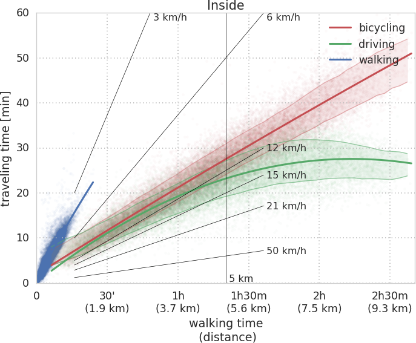

*`Data:` Google Maps -- `Period:` February - April 2017 -- `# of trips:` ~21690 -- `Code`: [Time Paris](notebooks/TimeParis.ipynb)*

The plot shows the ETA (estimated time of arrival) for trips between random points within Paris by 3 different means of transport (comparison with transit [here](#transit), comparison including parking time [here](#comparing-trips)).
Shaded points correspond to raw data. Solid line is the mean trend, shaded areas correspond to 1 standard deviation from average. Solid thin black lines correspond to characteristic velocities.

The x-axis has two equivalent scales: **1.** geodetic distance in km, computed with the [haversine rule](https://en.wikipedia.org/wiki/Haversine_formula), and **2.** walking time at 3.5 km/h.
The mark at 5km is about the radius of the periferique from Notre Dame (shown in the [methods section](#how)).

One can read two tales from the plot about: one for distances shorter than 5km, and one for distances  bigger than 5km.

1. Case of trips shorter than 5km:

	1. Transit is about 10 min slower than both cars and bikes, on average.

	2. Cars and bike have the same speed (12 km/h), meaning that the effective velocity of cars is, on average, even less than half of the proposed limit of [30km/h](https://leparisien.fr/paris-75005/tout-paris-a-30-km-h-c-est-pour-demain-14-09-2017-7261308.php). But bikes are clearly slower than needed. My guess is that it's a *network limitation* as both means are constrained by the same traffic lights.
	Note here that I expect bikes to respect the driving code, and to stop when needed.

2. Case of trips longer than 5 km:
	1. Here cars hit the periferique and can go faster than bikes. But  my statistics goes down in quality, too.
	2. Since the average bike speed is constant with distance I think that it's really just constrained by the network, which does not have fast long-distance bike ways.

In this 2011 [study](http://dl.acm.org/citation.cfm?id=2560188), it is shown (fig. 4) that the bike trip length is about 2km, in sync with the pricing policy, and may be within the last-mile (fig. 3) for most Velib users. The plot above shows that 2km is just about half the convenient distance.

## Comparing trips

*(**left**) The two histograms show the distribution of traveled distance by means of transport. (**right**) Distribution of geodetic distances only of convenient trip  by means of transport.  Bin width: 1 km. [[Code](notebooks/TimeParis-plots-kgCO2.ipynb)]*

The histogram on the left panel shows that for, the same departures and destinations, cars may need longer trajectories than bikes.
Is this in contradiction with the previous observation that bikes and cars may share the same network constraints? Since the histogram begin to diverge at about 5km, it can be that the difference is due to the periferique: a path in the periferique is faster but longer than in regular streets.

On the right panel I show the histogram of geodetic distances for convenient trips by means of transport.
Turns out that **~20%** of the trips are convenient by bike, and about 30% for trips shorter than 5 km.

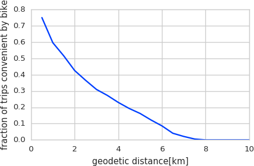|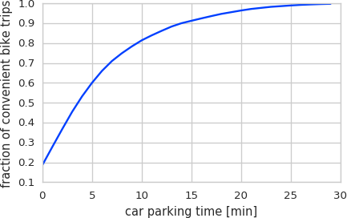
:--------------------:|:---------------------:
*Plot of the fraction of convenient bike trips versus geodetic distance*|*Plot of fraction of convenient bike trips versus hypothetical parking time*

The plot on the left shows that, currently, trips shorter than 2 km have more than 50% probability of being convenient by bike. The plot on the right shows that if parking takes just 5 min, then bike trips are more convenient about ~60% of the times, instead of ~20%.

### CO2 production
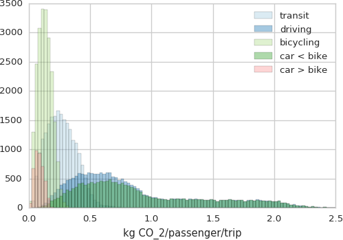

*Estimated CO2 production per passenger per trip for uniform trip distribution. Carbon production is estimated from the Refs. [1, 2]. Remember that these histograms are not weighted with the real trips distribution, hence it's not representative of the current production. The label `car < bike` stands for cars faster than bikes, viceversa `car > bike` means the opposite. [[Code](notebooks/TimeParis-plots-kgCO2.ipynb)]*

Useless to say, every means of transport has an impact on CO~2~ production. Bikes and public transport of course make no exception (Refs. [1, 2]). For bike the estimate considers production, maintenance and fuel. The figure above shows the total impact on carbon production if bikes were always chosen when more convenient. For the uniform distribution of trips I employed, this would lead to **~20%** less kg CO~2~/passenger/trip.

So, in spite of a 20% of trips which are more convenient by bike, we get a mere 10% reduction of CO~2~ production.
One reason may be found on the distribution of trips favourable by bike.
As noted already in the previous section **"Comparing Trips"**, bikes win over cars on short trajectories.
Hence they take away a smaller part of the total CO~2~ production.

> **Speculative thoughts warning**
>
> Nonetheless, things do not need to be so dark. I ignored a  feedback mechanism: removing 20% of cars from the network may lead to a less congested traffic which, in turn, would reduce it's own footprint, and facilitate car trips of those who really need it (taxis, deliveries, ..)

## Structure/Network

In the second figure we have seen that about 20% of randomly chosen trips in Paris are worth to be done by bike.
Here we explore the network properties of the ways that are more convenient to cars or to bikes.

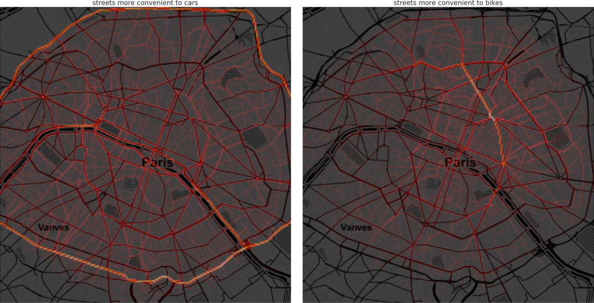

*(**Left**) Where cars go when it's more convenient to them, (**Right**) Where bikes go when it is more convenient. (Colorcode): increasing from black to red to white. The scale is not linear to show also low intensity signal: I used the square root. Bin width: approx 50 m x 50 m [[Code](notebooks/TimeParis-plots-map.ipynb)].*

Histograms of passages. I tessellated the city in ~50mx50m bins counting how often a trip goes through each bin. Hence, the brighter a point, the more often it is visited.
The left (right) panel shows where it is more convenient to go by car (bike). Without much surprise, the trajectories are on streets. So the two histograms highlight the streets (or parts of streets) which act as hubs for bikes and cars.

<!-- Since each path is also the optimal path between two points, this may be linked to a measure of betweeness of each node of the network, where a node is a pixel (see [Network properties](network.md)). -->

From the left panel (1) there is no evident area of Paris in which cars are systematically  less convenient, and (2) the density of passages is very similar to the [real one](https://github.com/astyonax/heartbeat-traffic).
This evidence may support the idea that a uniform distribution of departures and destinations is reasonable to represent the real distribution of trips (**TODO**: quantify this).
Maybe, the reason is that the density of people in Paris is so high (21000/km2 [wikipedia]).

The right panel shows the streets where bikes are more likely to be convenient.  We can note some areas of lower density in the 13th and 17th arrondissements. Then, three backbones are highlighted, but they are clearly not enough to cover the entire Paris, and somewhat biased towards north-west of the city. This means that, although some effort to construct more efficient bike connections, e.g. the north-south one,  the effect is either tiny (or Google maps did not know yet) or not enough to connect the entire city.
The map below illustrates the Paris Bike Plan.
I think that it is worth to note that the longest backbone, spanning from Republique to Gare du Nord is `Boulevard de Magenta`, which has a an [isolated bicycle way](https://goo.gl/maps/A3ZK6FDfyYQ2).

Note also that some of the backbones go through some crossings which are a real circus (e.g. [Bastille](https://goo.gl/maps/sQHQtWNHoMw) or [here](https://www.google.com/maps/@48.8450272,2.3656301,400m/data=!3m1!1e3)).

### Backbones
As comparison to the histogram above, here I show the histogram for all trajectories either by bike or by car. This highlights the streets which are more probably visited by the chosen mean of transport.

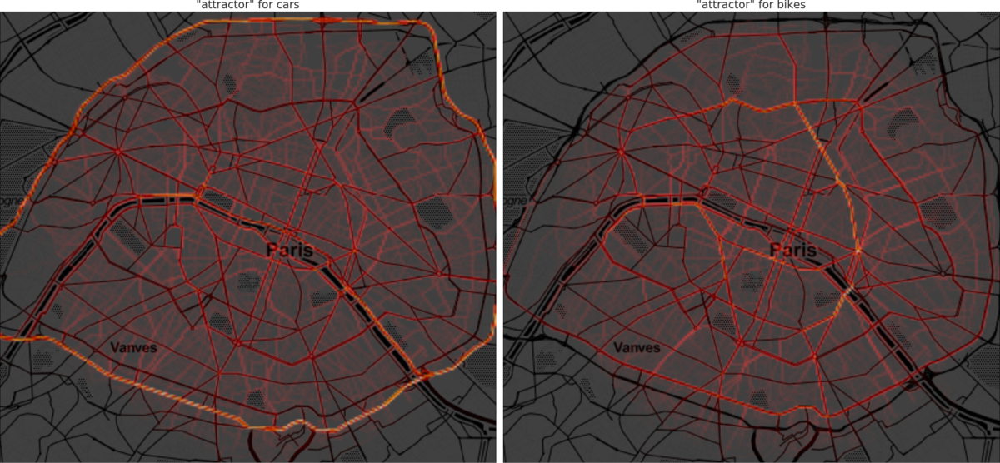

The map above shows the backbones of Paris either for driving or bicycling.
At first sight, there is a sort of ring of boulevards inside Paris which may be used to enhance and simplify the life of bikers.
Thus, one may designate car-oriented boulevards and bike-oriented boulevard, enhancing the traffic isolation. However, before further thoughts, I need to compare these results with those obtainable with the alternative routing engines (e.g. Graphhopper, ORSM, bbbike, BRouter.de,etc..) to remove google maps' specific bias. (not hard, **TODO** soon). Note also that geometric factors (e.g. dilution as we move from center to the buondary of Paris may need to be corrected)

#### Bike Plan of Paris

*From https://planvelo.paris/assets/images/pages/engagements_schema.jpg*

Comparing the *Plan Velo* to the previous histogram, we see that there are some differences between the fastest routes for bikes and the position of new and present bicycle ways. It is difficult to draw generic explanations for this phenomenon. But, as said, before drawing conclusions, the previous histogram needs to be compared to results of alternative routing softwares.

### Clusters

In the previous section we've seen that the north-west of Paris, and in particular Boulevard de Magenta are areas which are faster to travel by bike.
The comparison was done among all possible trips in which bikes are faster than cars. Hence, it shadows local structure among the trips.

To reveal hidden structure we need to change point-of-view.
We are used to think that trips connect two points A, and B on a plane. To find whether we are missing hidden structure, I map departure and destination to one point in 4D space. Thus, given departure A=(Ax,Ay) and destination B=(Bx,By), we get C=(Ax,Ay,Bx,By). The tuple is ordered, the point obtained swapping departure and destination D=(Bx,By,Ax,Ay) represents the backward trip, hence C is different than D (i.e. C-D $\neq$ (0,0,0,0)).

With this approach, K-means clustering distinguishes between trip directions and clusters contain also the directional information, not just the geometrical connection.

I find that the city can be divided in 8 clusters (**TODO**: use the approach in [here](http://linkinghub.elsevier.com/retrieve/pii/S0925231214005049) )

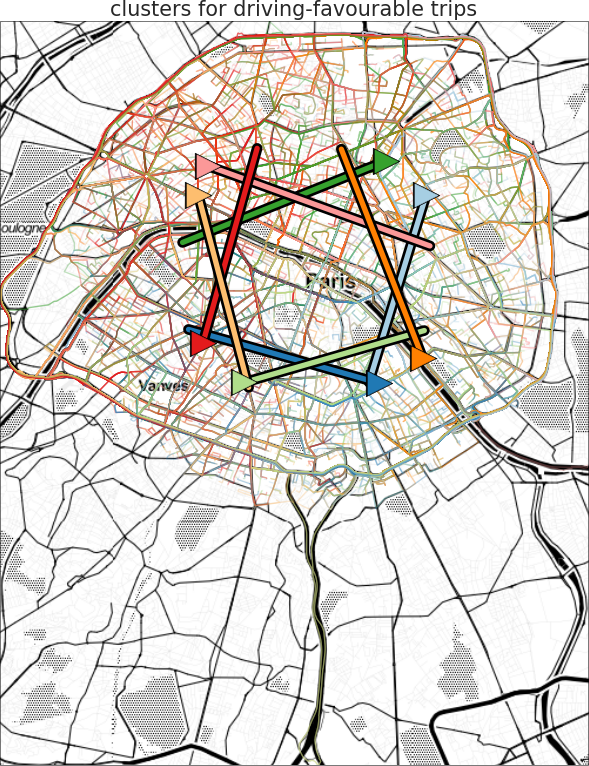 | 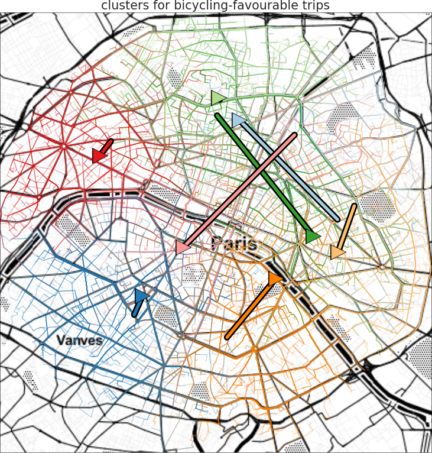
-------------------------|---------------------------

 *Paths with the same colors belong to the same cluster (see main text). Thick lines connect the average departure and average destination of the trips belonging to the cluster of corresponding color, hence: short line implies a small polarity, long line implies big polarity*. [[Code](notebooks/TimeParis-plots-map.ipynb)]

The two plots illustrates the clusters for cars (left) and for bikes (right). Each cluster is color-coded.
The 8 clusters for cars form a clockwise pattern of 4 clusters, and a counter-clockwise pattern of the remaining 4 clusters. In this case, the ~17500 path which are favorable by car well connect the entire city.

On the right the clusters for bikes are presented.
Unsurprisingly, 4 clusters are oriented more or less along the highlighted backbones of the previous section. The remaining clusters show, IMHO, a *bubble-like phenomenon*: if you are in the red or blue or light-green areas, it is rarely efficient to exit your cluster by bike. Indeed these clusters are not directional (very short line).

The problem is that the **bubble like clusters are small** in comparison to distances one might expect to bike.
This concept is maybe more evident in the next plot where only a selection of paths is shown. The paths are selected to have departure and destination  from within one standard deviation from the cluster average departure and destination, respectively.
This suppresses much of noise, but gives the impression of even smaller bubbles.

Finally, the Seine naturally generates segregation because you need bridges to cross it, and this implies long detours and complex street crossings. This is well shown by the blue and red clusters above, and probably influences the polarity of the light-green and orange clusters.

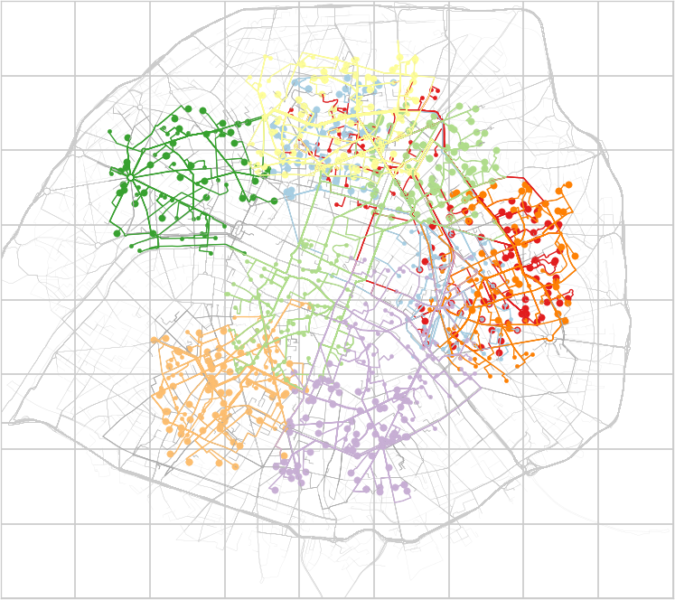

*Big dots: departures points. Small dots: destination points. Each color corresponds to a cluster.  This picture illustrates that there are bubble-like areas from which it is not convenient to exit by bike.* [[Code](notebooks/TimeParis-plots-selection.ipynb)]

## Part 2 - How to enter in the city

So, assuming that Parisian know their city, where are all the cars coming from?
Well, one safe bet is from outside Paris. Indeed, the periferique wakes up about 1hr before the city [(hearbeat-traffic)](https://github.com/astyonax/heartbeat-traffic).The following plots are very similar to the previous ones so the explanation will be slim.
For the following analysis, starting points up to 10km from Paris (or 20km from Notre Dame) where connected to ending points inside Paris.
This implies that the maximum trip is about 25km.. about enough for the average biker! The dataset comprises 22970 trips.

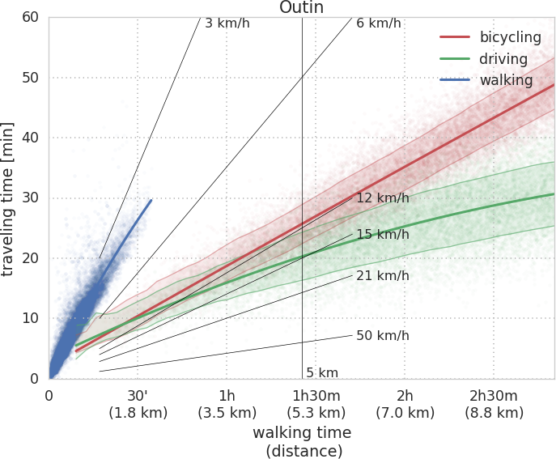

*`Data:` Google Maps -- `Period:` February - April 2017 -- `# of trips:` ~22970 -- `Code`: [Time Paris](notebooks/TimeParis.ipynb)*

This plot shows that the average driving speed is not that much higher with respect to trips only inside Paris. We expect cars have an easier life here, because we expect a less dense, and more rational network of streets. But for trips shorter than 5 km, bikes take just 5 minutes longer than cars. And at 7 km, cars are barely 10 min ahead of bikes. For longer trips, the car is obviously more convenient, as it should be.

Nonetheless, do not fool yourself: not all suburbs are safe to bike!

### Counting trips
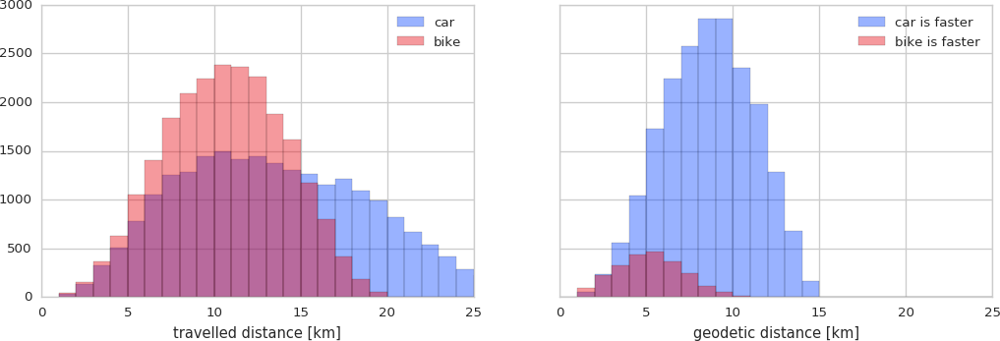

*These histograms show the distribution of trips versus  the traveled distance. In light shades the histogram for all trips. In dark shades the same trips filtered by more convenient by car (red) or by bike (blue). The label `car < bike` stands for cars faster than bikes, viceversa `car > bike` means the opposite.  [[Code](notebooks/TimeParis-plots-kgCO2.ipynb)]*

I find that only **~5%**  of the entering trips are more convenient by bike than by car (20% if trip is shorter than 5 km). This is  a big reduction from the 20% we saw for trips inside Paris. I try to justify this with two rationale: 1. trips are longer, 2. the network is even more car oriented. To distinguish the two I will (**TODO**) resample the dataset to have the same distances distribution as inside Paris prior to comparing the percentage of convenient trips.

Thus, you have to be lucky to find it convenient to get into Paris from outside. (Yet, you would spare so much money w/o a car, stress in the traffic jam, money&time for parking, + less pollution that I would give it a try).

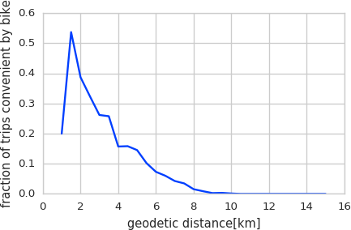|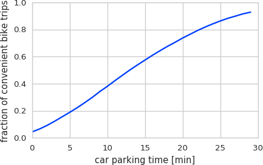
:--------------------:|:---------------------:
*Plot of the fraction of convenient bike trips versus geodetic distance*|*Plot of fraction of convenient bike trips versus hypothetical parking time*

### Structure
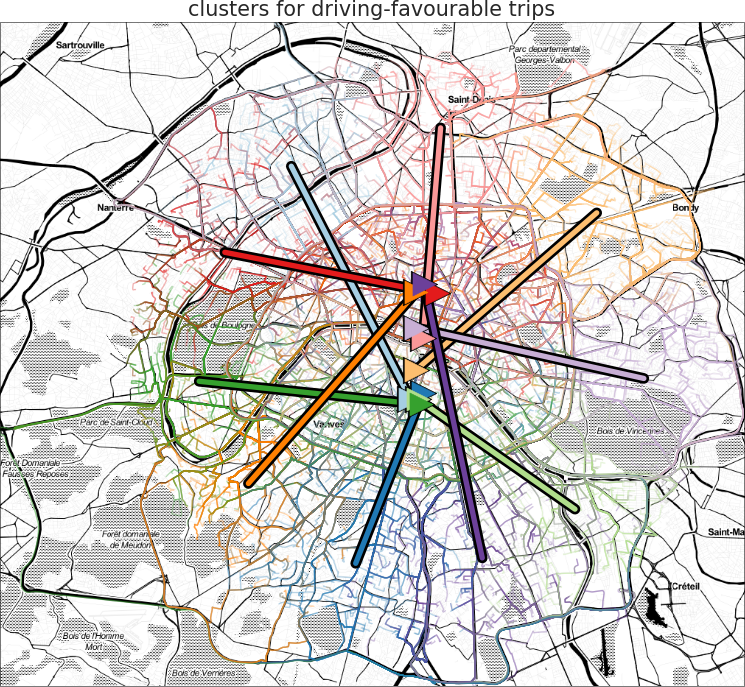 | 
-------------------------|---------------------------

 *Paths with the same colors belong to the same cluster (see main text). Thick lines connect the starting and ending points of the cluster of the corresponding color, hence: short line implies a small polarity, long line implies big polarity*. [[Code](notebooks/TimeParis-plots-map.ipynb)]

On the left(right), clusters for driving(bicycling)-favourable trips. As expected from the previous plot, bicycling inside Paris is convenient only for destinations within 5km, which roughly correspond to points along the same radial direction. That is what's shown  by the right plot.
Note also that the northern part of Paris seems more bike-oriented. However,  this may be an  artifact; if that area is usually more busy, than bikes clearly win.

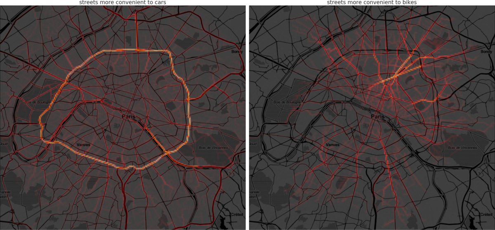

*(**Left**) Where cars go when it's more convenient to them, (**Right**) Where bikes go when it's more convenient [[Code](notebooks/TimeParis-plots-map.ipynb)].*

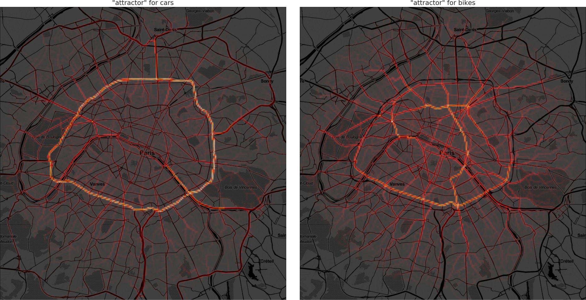

*Histogram for all trajectories either by bike or by car. This highlights the "attractor", or the streets which are more probably visited by the chosen mean of transport. [[Code](notebooks/TimeParis-plots-map.ipynb)].*

These last four figures highlight the streets which are most visited when driving (left) or bicycling (right) entering Paris from its nearest suburbs.
For cars it does not make much of a difference that we plot only the optimal ways (top) or all of them (bottom). Indeed, only ~10% of the analyzed paths are not convenient by car. In comparison to the traffic just inside Paris (see above), it is evident and [expected](https://github.com/astyonax/heartbeat-traffic) that the periferique plays a central role.
For bicycles instead, the top plot on the right clearly shows that the Seine acts like a natural barrier, and that most of the proposed work to render the access routes to Paris more bike-friendly are indeed needed (see above Paris Bike Plan 2010).
The bottom plot highlights the possible bicycling highways (**TODO**: same as before, remove Google Maps bias).

These measurs suggests again that it is possible to physically separate high -speed and -throughput bike lanes from high -speed and -throughput car lanes.
This separation would bring the best of the two means of transport together IMHO.
We can't expect that an (extended) city moves only by car or by transit or by bikes. But a combination of three which best allocates needs and resources seems possible (w/o Haussmannian approaches).

## Conclusion

On the contrary to most research projects, the results of an analysis of directly tangible subjects can stimulate strong feelings.
Please, do not let it happen.

Within the limitations of this analysis (which are mostly marked with a **TODO**),
I showed that

2. About ~20% of trips inside Paris are convenient to be done by bike.

1. Both bikes and cars run at the average speed of ~12 km/h.

5. As of now, the north-west part of Paris seems more bike-friendly  than the rest of Paris. Is it an artifact or bias in the data? I will compare with different routing engines.

3. From a travel-time perspective, the "effective" network for cars is very well developed and connects efficiently all parts of the city. The network for bikes shows polarized and bubble-like areas. The first is an area of Paris for which only one direction is convenient by bike. The second an area of Paris from which it is hardly convenient to quit by bike.

4. Streets which are most visited by cars separate from those by bikes, suggesting the possibility to create two separated networks: one car oriented, and one bike oriented.

6. The Seine is a barrier for bikes, but not for cars.

7. In comparison to mobility within the city,  the suburbs strongly disadvantage bicycling. Is there an official figure of number of trips by means of transport?

2. Comparing the attractors of the  bicycling network inside Paris, with the Plan Velo 2015-2020 we can see some overlap; but the overlap is not perfect. More seems needed to support bicycling right outside of Paris.

3. When comparing the Plan Velo with the optimal paths connecting the suburbs with the city center, it happens to see that the problem of crossing the major city doors is not yet fully addressed.

Finally, building on this works it will be interesting to:

2. solve most TODOs, ofc ;)
1. Correlated infrastructure with current bike network (in preparation)

3. From the previous plots 2 new effective networks arise: that convenient to cars and that to bikes.  I want to:
	1. Characterize them as usually done for networks (so centrality/betweeness/etc..) (in preparation too)
	2. Use that info to optimize the network

## Appendix
### How
The data is obtained by querying Google maps API for the travel time at _8am_ on Wednesdays (see real traffic data at 8am in my [parallel project](https://github.com/astyonax/heartbeat-traffic) ).
This means that I don't compare the actual usage of the network, because for Paris we don't have the datasets. The only study I know which had access to Velibs trips is from 2011 [[here]](http://dl.acm.org/citation.cfm?id=2560188). I know of no study with similar data on trips by car or transit. Clearly it would be very interesting to compare directly Velib trajectories with respect to car or taxis trajectories, as done in here for [NYC](http://toddwschneider.com/posts/taxi-vs-citi-bike-nyc/), but at the moment I didn't find a way.

Since I used Google's data and routing engine, I don't have full control of the machinery, which behaves like a black-box. My reasoning behind it are: 1. simplicity (it just works) 2. people use it and follow its indications, so it may even be less worse than expected 3. the proposed trajectories pass through way-points with the same density to the [real-data](https://github.com/astyonax/heartbeat-traffic) 4. with custom routing engine (e.g. OSRM) we may as well be quite wrong 5. for bikes, alternative routing software exists, but it is not well tested in Paris. So, let it be Google.

### How many points
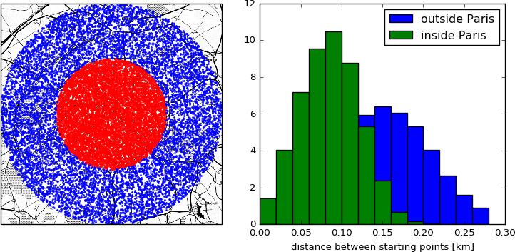
*Distribution of departure points either inside or outside Paris [[Code]](notebooks/SamleParis.ipynb).*

The plot above shows that the average distance of departure points is 100 m and 150 m inside and outside Paris, respectively.

### Transit
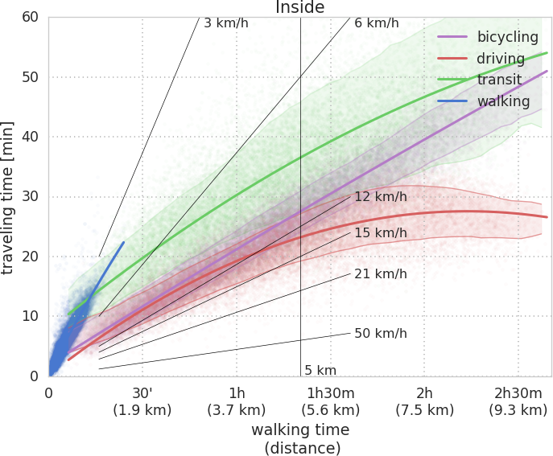

*`Data:` Google Maps -- `Period:` February - April 2017 -- `# of trips:` ~21690 -- `Code`: [Time Paris](notebooks/TimeParis.ipynb)*

The ETA for transit is a total time which sums together approaching, waiting, and traveling times.
**Note** that comparison of driving time versus transit time is **unfair** because transit time counts also the approaching and waiting times, for cars and bikes only the travel time is considered.
Although with the current protocol transit time is, at worst, just 15 min slower than driving time, which seems about the dead time one would expect because of parking and approaching, I do not have a quantitative estimate. Hence, *I did the analysis ignoring the transit time*.

# Literature
## Cited academic articles

* [A tale of two cities. Vulnerabilities of the London and Paris transit networks](https://arxiv.org/pdf/1206.2599.pdf)
* [Spatio-temporal Clustering and Forecasting Method for Free-Floating Bike Sharing Systems](https://link.springer.com/chapter/10.1007/978-3-319-48944-5_23)
* [Understanding bike trip patterns leveraging bike sharing system open data](https://link.springer.com/article/10.1007/s11704-016-6006-4)
* [Global bike share: What the data tells us about road safety](http://www.sciencedirect.com/science/article/pii/S0022437515001024)

### Bibliography

3. von Ferber, C., Berche, B., Holovatch, T. & Holovatch, Y. A tale of two cities. Vulnerabilities of the London and Paris transit networks. Journal of Transportation Security 5, 199–216 (2012).
4. Freeman, L. A Set of Measures of Centrality Based on Betweenness. Sociometry 40, 35–41 (1977).
5. Barthelemy, M., Bordin, P., Berestycki, H. & Gribaudi, M. Self-organization versus top-down planning in the evolution of a city. Scientific Reports 3, (2013).
6. Carra, G., Mallick, K. & Barthelemy, M. The coalescing colony model: mean-field, scaling, and geometry. arXiv:1709.08628 [cond-mat, physics:physics, q-bio] (2017).
7. Kirkley, A., Barbosa, H., Barthelemy, M. & Ghoshal, G. Structural invariants in street networks: modeling and practical implications. arXiv:1709.05718 [physics] (2017).
8. Gallotti, R., Louf, R., Luck, J.-M. & Barthelemy, M. Tracking random walks. arXiv:1704.00480 [cond-mat, physics:physics] (2017).
9. Bazant, M. Z. Conformal mapping of some non-harmonic functions in transport theory. arXiv:physics/0302086 (2003).
10. Etienne, C. & Latifa, O. Model-based count series clustering for bike sharing system usage mining: a case study with the Vélib’system of Paris. ACM Transactions on Intelligent Systems and Technology (TIST) 5, 39 (2014).
11. Randriamanamihaga, A. N., Côme, E., Oukhellou, L. & Govaert, G. Clustering the Vélib׳ dynamic Origin/Destination flows using a family of Poisson mixture models. Neurocomputing 141, 124–138 (2014).
12. Wang, X. et al. Building Efficient Probability Transition Matrix Using Machine Learning from Big Data for Personalized Route Prediction. Procedia Computer Science 53, 284–291 (2015).
13. von Ferber, C., Berche, B., Holovatch, T. & Holovatch, Y. A tale of two cities. Journal of Transportation Security 5, 199–216 (2012).
14. Fishman, E. & Schepers, P. Global bike share: What the data tells us about road safety. Journal of Safety Research 56, 41–45 (2016).
15. Fishman, E., Washington, S. & Haworth, N. Bikeshare’s impact on active travel: Evidence from the United States, Great Britain, and Australia. Journal of Transport & Health 2, 135–142 (2015).
16. Caulfield, B., O’Mahony, M., Brazil, W. & Weldon, P. Examining usage patterns of a bike-sharing scheme in a medium sized city. Transportation Research Part A: Policy and Practice 100, 152–161 (2017).
17. Caggiani, L., Ottomanelli, M., Camporeale, R. & Binetti, M. Spatio-temporal Clustering and Forecasting Method for Free-Floating Bike Sharing Systems. in Advances in Systems Science (eds. Świątek, J. & Tomczak, J. M.) 539, 244–254 (Springer International Publishing, 2017).
18. Chen, L., Ma, X., Nguyen, T.-M.-T., Pan, G. & Jakubowicz, J. Understanding bike trip patterns leveraging bike sharing system open data. Frontiers of Computer Science 11, 38–48 (2017).

## Online
* [If you build it, they will ride: pop-up bike lanes prove that demand exists](http://bicycletimesmag.com/if-you-build-it-they-will-ride-pop-up-bike-lanes-prove-that-demand-exists/)
* [This ingenious illustration reveals how much space we give to cars](http://uk.businessinsider.com/car-illustration-karl-jilg-2017-4?utm_content=buffer5ea4b&utm_medium=social&utm_source=facebook.com&utm_campaign=buffer-ti&r=US&IR=T)
* [Paris : l'impact réel de la piétonnisation des voies sur berges](http://www.lejdd.fr/JDD-Paris/EXCLUSIF-Paris-l-impact-reel-de-la-pietonnisation-des-voies-sur-berges-812212)
* [Paris en Selle](https://parisenselle.fr/association-velo/)
* [#HackingParis2024: place aux acteurs de l’innovation](http://www.paris.fr/actualites/hackingparis-participez-au-grand-rassemblement-des-acteurs-de-l-innovation-4546)
* [When Paris Closed A Major Road To Cars, Half Its Traffic Just Disappeared](https://www.fastcompany.com/3064157/when-paris-closed-a-major-road-to-cars-half-its-traffic-just-disappeared)
* [Paris Is Redesigning Its Major Intersections For Pedestrians, Not Cars](https://www.fastcompany.com/3058685/paris-is-redesigning-its-major-intersections-for-pedestrians-not-cars)
* [Paris Air Pollution: Real-time Air Quality Index](http://aqicn.org/city/france/paris/paris-centre/)
* [Aggregated multimodality platform — CityMakers EN](https://citymakers.io/multimodality/)
* [Observatoire du Plan Vélo de Paris](https://planvelo.paris/)
* [QuantUrb - Home](http://www.quanturb.com/)
* [Bruit Paris](http://rumeur.bruitparif.fr)
* [How the Dutch got their cycling infrastructure](https://bicycledutch.wordpress.com/2011/10/20/how-the-dutch-got-their-cycling-infrastructure/)
* [“En 2030, il y aura plus de vélos que d'autos dans Paris” - Sortir - Télérama.fr](http://www.telerama.fr/sortir/en-2030,-il-y-aura-plus-de-velos-que-dautos-dans-paris,n5196342.php?utm_campaign=Echobox&utm_medium=Social&utm_source=Twitter#link_time=1507627023)

## Data Sources
* [1][Carbon footprint calculator](https://carbonfund.org/how-we-calculate/)
* [2][ETA -- co2 production by bike](https://www.eta.co.uk/2011/12/13/co2-emissions-from-cycling-revealed/)
* [OpenData RATP](https://data.ratp.fr/explore/dataset/trafic-annuel-entrant-par-station-du-reseau-ferre-2014/)
* [Air pollution in Paris](https://www.airparif.asso.fr/#)

# License
The movies, animation, plots, and texts (said the content) of this project are licensed under the [Creative Commons Attribution Share Alike 4.0](https://creativecommons.org/licenses/by-sa/4.0/) license, and the underlying source code used to gather, collect, analyze, format, render, and display that content is licensed under the [GNU GPLv3](http://www.gnu.org/licenses/gpl-3.0.txt) license.
