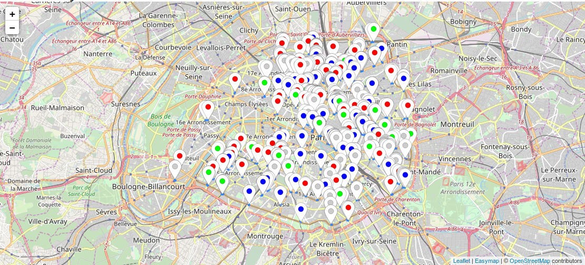

# Where to park my bike

Hey, man! If you landed here, you probably want to see the result of this code: [serve yourself](http://htmlpreview.github.com/?https://github.com/astyonax/TimingParis/StationsBikePark/interactive_map/parkmybike.html).
This is a small projects which grew up alongside other projects on Paris, mobility, and #opendata and #smartcity, as [Timing Paris](https://github.com/astyonax/TimingParis) and [Heart Beat of Paris](https://github.com/astyonax/heartbeat-traffic).

Here I take the problem of an *inter-modal* commuter who wants to go to the most convenient subway station by bike instead of, e.g., taking connecting metros or walking. Rather academicly, or if this commuter is polite, this poses the problem of parking the bike *near* the subway entrance on a dedicated space which does not annoy other peoples.

Stated in another way: How do we correlate bike parkings and subway entrances?
Turns out that, thanks to OpenStreetMaps, cities can be queried as databases  (eg, the [OverPass API](http://wiki.openstreetmap.org/wiki/Overpass_API))
and from that we get all that is needed.

Undoubtely, I may have spent more on this to get more refined data, but don't be shy and open a *pull request* with enhancements!!

---

## Steps

Thus, here follow the steps needed to recreate (and update) the map.

0. You need a working OSRM server locally, with the db of Paris (or ile-de-france).

1. Query OpenStreetMaps for bike parks and subway entraces: `scripts/queries.py` .
*Requirements*: `dill` and `overpy` (for OSM overpass API)

2. Make map between stations and top 10 nearest bike parks and viceversa:  `scripts/filtering.py`
*Requirements*: `numba, dill, pandas, numpy`

3. Run the jupter-notebook `makemap.ipynb`

4. Open the [webpage](http://htmlpreview.github.com/?https://github.com/astyonax/TimingParis/blob/master/StationsBikePark/interactive_map/parkmybike.html)
